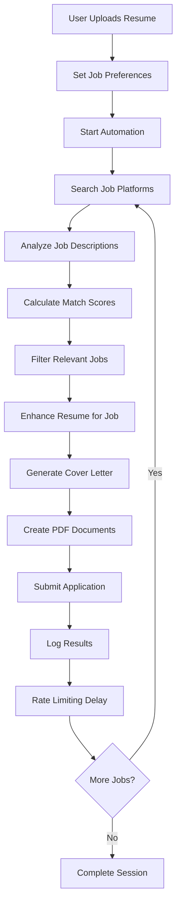

# AutoJobApply System Overview

## How AutoJobApply Works Without URLs

AutoJobApply is an intelligent job application automation system that can find and apply to jobs without requiring specific URLs. Here's how it works:

### 1. **Intelligent Job Discovery**

The system uses multiple discovery methods to find relevant job postings:

#### **Web Scraping**
- **LinkedIn Jobs**: Scrapes LinkedIn's job search pages using keywords and location filters
- **Indeed**: Searches Indeed's job listings with automated pagination
- **Newspaper Job Sections**: Scrapes job postings from major newspapers in Canada and USA
- **RSS Feeds**: Monitors job-related RSS feeds from news sources

#### **Search Strategy**
```python
# Example: How the system finds jobs
search_keywords = ["Software Engineer", "Python Developer", "Full Stack"]
locations = ["Remote", "Toronto", "New York"]

for keyword in search_keywords:
    for location in locations:
        jobs = scraper.search_jobs(keyword, location)
        filtered_jobs = filter_by_preferences(jobs, user_preferences)
        apply_to_jobs(filtered_jobs)
```

### 2. **Custom AI Engine**

Our proprietary AI engine handles job matching and application optimization:

#### **Job Analysis**
- Analyzes job descriptions to extract key requirements
- Identifies required skills, experience level, and company culture
- Calculates match scores between user profile and job requirements

#### **Resume Enhancement**
- Automatically optimizes resumes for each specific job
- Adds relevant keywords naturally
- Emphasizes matching experience and skills
- Generates ATS-friendly formatting

#### **Cover Letter Generation**
- Creates personalized cover letters for each application
- Incorporates company research and job-specific details
- Maintains professional tone while showing genuine interest
- Optimizes for ATS scanning

### 3. **PDF Generation System**

The system automatically generates professional PDF documents:

#### **Resume PDF Features**
- Clean, professional formatting
- Optimized for ATS scanning
- Customized for each job application
- Proper typography and spacing

#### **Cover Letter PDF Features**
- Business letter format
- Company and job-specific content
- Professional header with contact information
- Proper date and salutation formatting

### 4. **Automation Workflow**

Here's the complete automation process:



### 5. **Platform Integration**

#### **Currently Supported Platforms**
- **LinkedIn**: Direct job search and Easy Apply integration
- **Indeed**: Job search and application submission
- **Newspapers**: Job posting extraction from news sources

#### **Planned Integrations**
- **Glassdoor**: Company research and salary insights
- **Handshake**: University career services integration
- **AngelList**: Startup job opportunities
- **Remote-specific platforms**: RemoteOK, We Work Remotely

### 6. **AI Learning System**

The system continuously improves through:

#### **Pattern Recognition**
- Learns from successful applications
- Identifies high-converting job descriptions
- Improves keyword matching algorithms
- Optimizes application timing

#### **Feedback Loop**
```python
# Example: Learning from application results
def learn_from_results(applications):
    successful_apps = filter(lambda x: x.status == 'success', applications)
    
    for app in successful_apps:
        # Extract successful patterns
        keywords = extract_keywords(app.job_description)
        company_type = analyze_company(app.company)
        
        # Update AI models
        update_keyword_weights(keywords)
        update_company_preferences(company_type)
```

### 7. **Rate Limiting and Ethics**

The system implements responsible automation:

#### **Rate Limiting**
- 5-second delays between applications
- Maximum 50 applications per session (configurable)
- Respects website rate limits and robots.txt

#### **Ethical Considerations**
- Only applies to relevant job postings
- Maintains application quality standards
- Respects platform terms of service
- Provides opt-out mechanisms

### 8. **Data Management**

#### **In-Memory Database**
Currently uses in-memory storage for development:
- User profiles and authentication
- Resume storage (base64 encoded)
- Job preferences and settings
- Application history and analytics
- Automation session tracking

#### **Production Database**
Ready for MongoDB integration:
```python
# Example: Database schema
{
    "users": {
        "id": "user_123",
        "name": "John Doe",
        "email": "john@example.com",
        "created_at": "2024-01-01T00:00:00Z"
    },
    "applications": {
        "id": "app_456",
        "user_id": "user_123",
        "job_title": "Software Engineer",
        "company": "Tech Corp",
        "status": "applied",
        "match_score": 0.85,
        "created_at": "2024-01-01T00:00:00Z"
    }
}
```

### 9. **API Endpoints**

#### **Core Endpoints**
- `POST /register` - User registration
- `POST /login` - User authentication
- `POST /upload-resume` - Resume upload
- `POST /set-job-preferences` - Job search configuration
- `POST /start-automation` - Begin job application process
- `GET /user-analytics/{user_id}` - Application statistics
- `GET /debug/database` - Database viewer (development)

#### **Real-time Features**
- WebSocket connections for live updates
- Progress tracking during automation
- Real-time application status updates

### 10. **Security Features**

#### **Authentication**
- Bcrypt password hashing
- Session management
- CORS protection
- Input validation

#### **Data Protection**
- Secure file upload handling
- Resume data encryption
- Privacy-focused data storage
- GDPR compliance ready

### 11. **Scalability Design**

#### **Horizontal Scaling**
- Microservices architecture
- Queue-based job processing
- Database sharding support
- Load balancer ready

#### **Performance Optimization**
- Async/await patterns
- Connection pooling
- Caching strategies
- Background task processing

### 12. **Monitoring and Analytics**

#### **User Analytics**
- Application success rates
- Platform performance metrics
- Job matching accuracy
- User engagement tracking

#### **System Monitoring**
- Application performance metrics
- Error tracking and logging
- Resource usage monitoring
- Platform availability checks

## Technical Architecture

### **Backend (Python/FastAPI)**
- RESTful API design
- Async request handling
- Background task processing
- Custom AI engine integration

### **Frontend (React/TypeScript)**
- Modern, responsive UI
- Real-time status updates
- File upload handling
- Analytics dashboard

### **AI Services**
- Custom resume enhancement
- Cover letter generation
- Job matching algorithms
- PDF document creation

### **Automation Engine**
- Multi-platform job scraping
- Intelligent job filtering
- Application submission
- Progress tracking

## Getting Started

1. **Setup**: Install dependencies and configure environment
2. **Register**: Create user account and upload resume
3. **Configure**: Set job preferences and search criteria
4. **Automate**: Start the automation process
5. **Monitor**: Track progress and view analytics

## Future Enhancements

- **AI Improvements**: Better job matching algorithms
- **Platform Expansion**: More job boards and platforms
- **Mobile App**: iOS and Android applications
- **Enterprise Features**: Team management and reporting
- **Integration APIs**: Third-party service connections

---

*AutoJobApply: Revolutionizing job search through intelligent automation* 